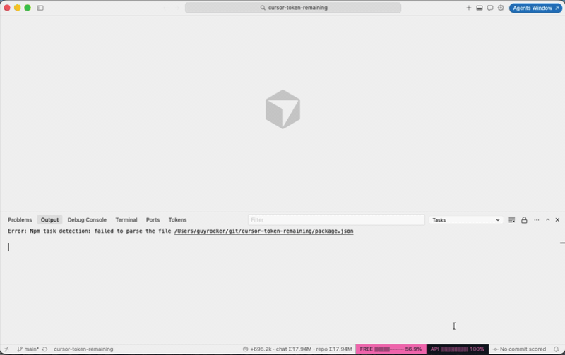

# Token Remaining

Usage meters for **Cursor**, **GitHub Copilot**, **Claude Code**, **Codex**, **Gemini CLI**, and **Windsurf**. Auto-detects whichever accounts are signed in on this machine.

Works as a VS Code-compatible extension (any fork that can install a VSIX), a CLI, and an MCP server.



## What you get

- Panel view **Tokens → Token Meters** grouped by provider, with `%` tubes
- Compact status bar chips (max 6)
- Hover a tube → breakdown when the provider sends one
- Click a tube → change fill / background color
- Refresh when local agent transcripts settle
- Background poll (default 60s)
- CLI (`token-remaining`) and MCP tool `get_usage` for every other IDE / agent

Providers without local credentials are skipped silently. A single provider failing does not hide the others.

## Providers

| Provider | Credentials | Meters |
|---|---|---|
| Cursor | `state.vscdb` `cursorAuth/accessToken` | FREE / API |
| Copilot | `~/.config/github-copilot`, `gh auth token`, or VS Code GitHub session | Premium / Chat / Completions |
| Claude Code | `~/.claude/.credentials.json` | Session / Weekly |
| Codex | `~/.codex/auth.json` | 5h / Weekly |
| Gemini CLI | `~/.gemini/oauth_creds.json` | Per-model remaining |
| Windsurf | Windsurf `state.vscdb` `windsurfAuthStatus` | Prompt / Flex credits |

Several of these APIs are unofficial and can change with the vendor.

## Install

### One-liner (no clone)

```bash
curl -fsSL https://github.com/SebberSky/cursor-token-remaining/releases/latest/download/bootstrap.sh | bash
```

Then reload the IDE window.

The installer lists every VS Code-compatible IDE on the machine, then **asks which one to install into** (one IDE per run). Reload that IDE afterwards.

Non-interactive: `TOKEN_REMAINING_IDE=1` or `TOKEN_REMAINING_IDE=Cursor`.

Zed, JetBrains, and ChatGPT.app cannot load a VSIX. Use the CLI or MCP there.

Extra CLIs: `TOKEN_REMAINING_BINS=/path/to/cli ./install.sh`

### From a clone

```bash
git clone https://github.com/SebberSky/cursor-token-remaining.git
cd cursor-token-remaining
./install.sh
```

Or:

```bash
npm install
npm run package
```

Then **Extensions: Install from VSIX…**, or press **F5**.

### CLI

After `npm install` / `npm run compile`:

```bash
node out/cli.js
node out/cli.js --json
node out/cli.js --provider cursor
```

Link globally with `npm link` to get `token-remaining` on your PATH (nvim / tmux / Claude Code / Cursor CLI statusline).

### MCP

Point any MCP host at:

```json
{
  "mcpServers": {
    "token-remaining": {
      "command": "node",
      "args": ["/absolute/path/to/cursor-token-remaining/out/mcp.js"]
    }
  }
}
```

Tool: `get_usage` with optional `provider`.

## Commands

- `Tokens: Refresh` (`tokenRemaining.refresh`, alias `cursorTokenRemaining.refresh`)
- `Tokens: Show Meters`
- `Tokens: Check for Updates`
- `Tokens: Sign in another provider`
- `Cursor Tokens: Change FREE/API Color` (legacy aliases)

## Settings

- `tokenRemaining.providers` — `["auto"]` or a subset: `cursor`, `copilot`, `claude`, `codex`, `gemini`, `windsurf`
- `tokenRemaining.pollIntervalSeconds` (default 60)
- `tokenRemaining.showStatusBar`
- `tokenRemaining.autoReveal`
- `tokenRemaining.checkUpdates` (default on)
- `tokenRemaining.autoUpdate` (default on — installs the latest GitHub VSIX then asks to reload)
- `tokenRemaining.updateCheckHours` (default 24)

`Cmd+Shift+P` → **Tokens: Check for Updates**, or click a meter → **Check for updates**.

Legacy `cursorTokenRemaining.*` keys still work.

## Release

Version comes from `package.json`. Pushing tag `vX.Y.Z` (must match) runs GitHub Actions: test, pack VSIX, create a GitHub Release with `extension.vsix` + `bootstrap.sh`.

```bash
./scripts/release.sh           # tag current version and push
./scripts/release.sh patch     # bump patch, commit, tag, push
```

The installed extension checks that release on startup and can auto-install.
